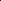
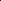

# VM Security Dashboard

> A lightweight, self-hosted SOC-style web panel for monitoring Ubuntu servers.
> Built with Python Flask. Secured with an access key. Runs entirely on your own infrastructure.


---

## What is this?

VM Security Dashboard is a real-time monitoring panel designed to give you full visibility into your Linux server from a browser. It was built for personal infrastructure where you want a clean, fast, always-on view of what is happening on your machine — without installing heavyweight tools like Grafana or Prometheus.

Everything runs as a lightweight Flask service. No database. No external dependencies beyond Flask and psutil. One command to install, one command to run.

---

## Screenshots

### Overview — Live System Stats


Real-time CPU, RAM, disk, and network metrics. Top 20 processes ranked by CPU usage. System uptime and boot time. Auto-refreshes every 3 seconds.

---

### Logs Panel


Browse system journal, service-specific logs (MediaMTX, Apache), firewall logs (UFW), and authentication logs — all from one place. Select log source and line count from the UI.

---

### Attack Monitor


The most important panel for security awareness. Shows:
- Failed SSH login attempts with source IPs
- Brute force IPs ranked by attempt count
- UFW firewall block events
- Successful logins (who got in and when)

---

### Services Status


Live status indicators for key services: SSH, UFW, Fail2ban, MediaMTX, Apache, Redis, PostgreSQL. Green = active, red = stopped/failed.

---

### Network Panel


Active TCP connections and open listening ports — pulled live from `ss`. Useful for spotting unexpected connections or verifying which services are exposed.

---

### Secure Terminal


A browser-based terminal with a strict command whitelist. Only safe read-only commands are permitted. No write access. Designed for quick diagnostics without needing SSH.

---

### Live Log Stream


Real-time log streaming using Server-Sent Events (SSE). Streams directly from `journalctl -f` — no polling, no refresh needed.

---

## Features

| Feature | Details |
|---|---|
| System Overview | CPU, RAM, disk, network I/O, uptime, top processes |
| Log Viewer | System journal, UFW, auth, Apache, MediaMTX |
| Attack Monitor | SSH brute force, failed logins, UFW blocks, successful logins |
| Services | Status of 7 common services with live indicators |
| Network | Open ports and active connections via `ss` |
| Terminal | Whitelisted browser terminal for safe diagnostics |
| Live Stream | Real-time log tail via SSE |
| Auth | Access key login — no user accounts needed |

---

## Security Model

- **Access key protected** — set your own key via environment variable
- **Internal network only** — UFW blocks port 5000 from the internet
- **Terminal whitelist** — only pre-approved read-only commands can run
- **No persistent storage** — no database, no logs written by the app itself
- **Session-based auth** — login expires when browser closes

This panel is designed to run on an internal network and **never** be exposed directly to the internet. Always keep it behind a firewall.

---

## Requirements

- Ubuntu 20.04 / 22.04 / 24.04
- Python 3.8+
- Root or sudo access (for reading system logs)

---

## Installation

### One-command install

```bash
git clone https://github.com/abdul259wasay-bot/vm-dashboard
cd vm-dashboard
sudo bash install.sh
```

The installer:
1. Installs Python dependencies
2. Copies files to `/opt/vm-dashboard/`
3. Creates a Python virtual environment
4. Installs and starts a systemd service
5. Adds a UFW rule to restrict access to internal network

### Manual install

```bash
pip3 install flask psutil
python3 app.py
```

---

## Configuration

Set your access key via environment variable (recommended):

```bash
export DASHBOARD_KEY="your-strong-key-here"
export FLASK_SECRET="your-flask-secret-here"
python3 app.py
```

Or edit directly in `app.py`:

```python
SECRET_KEY = os.environ.get('DASHBOARD_KEY', 'change_this_key')
```

---

## Access

```
http://<your-server-ip>:5000
```

Enter your access key when prompted. The session is valid until you close the browser or click logout.

---

## Managing the Service

```bash
# Status
sudo systemctl status vm-dashboard

# Restart
sudo systemctl restart vm-dashboard

# Stop
sudo systemctl stop vm-dashboard

# View logs
sudo journalctl -u vm-dashboard -f
```

---

## UFW Firewall

Restrict dashboard access to your internal network only:

```bash
# Block from internet
sudo ufw deny 5000

# Allow from your internal subnet only
sudo ufw allow from <YOUR-INTERNAL-SUBNET> to any port 5000 proto tcp
```

---

## Project Structure

```
vm-dashboard/
├── app.py                  # Flask backend — all API routes
├── install.sh              # One-click installer script
├── vm-dashboard.service    # Systemd service definition
├── requirements.txt        # Python dependencies
├── README.md
├── screenshots/            # UI screenshots
└── templates/
    ├── login.html          # Access key login page
    └── dashboard.html      # Main dashboard UI
```

---

## API Endpoints

| Endpoint | Description |
|---|---|
| `GET /api/stats` | CPU, RAM, disk, network metrics |
| `GET /api/processes` | Top 20 processes by CPU |
| `GET /api/logs/system` | System journal |
| `GET /api/logs/auth` | Auth log |
| `GET /api/logs/ufw` | UFW firewall log |
| `GET /api/logs/mediamtx` | MediaMTX service log |
| `GET /api/logs/apache` | Apache access log |
| `GET /api/attacks` | SSH failures, brute force IPs, UFW blocks |
| `GET /api/services` | Service status for 7 common services |
| `GET /api/connections` | Active TCP connections |
| `GET /api/ports` | Open listening ports |
| `POST /api/exec` | Execute whitelisted command |
| `GET /api/stream/logs` | SSE real-time log stream |

All endpoints require a valid session (login first).

---

## Tech Stack

- **Python 3** + **Flask** — backend and API
- **psutil** — system metrics (CPU, RAM, disk, processes)
- **systemd** — service management integration
- **Server-Sent Events** — real-time log streaming
- **Vanilla JS** — frontend, no frameworks

---

*Built for personal infrastructure monitoring. Keep it internal.*
